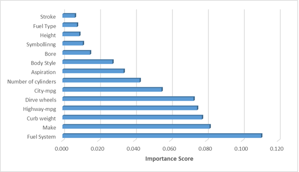

# Automobile-Price-Prediction

This project was a team effort to predict automobile prices, based on a dataset of 205 cars. Automobile price prediction has use cases in **providing price advice** to both second-hand car buyers and auto-dealers. It can heavily diminish reliance on specific mechanical expertise and even assist in odometer fraud detection.

This repository contains the final report and presentation, as well as the code used to process, train, and visualize data. A requirements.txt file is attached which contains the python libraries required to run the Jupyter Notebook code. Note that some exact output values in the notebook may vary due to model plotting randomness. *The CRISP-DM industry standard framework was followed*. The project builds on top of existing scientific literature and enrichens it by providing a new perspective.

Because 4 rows did not have an entry for the price column (the target/ dependent variable), they were dropped from the table, leaving 201 entries. The price column was transformed from numerical to categorical with 3 categories, splitting them into 3 quantiles: 0-0.33, 0.33-0.66, 0.66-1.

Data was split into a training set (150 samples) and a test set (51 samples). The **75%-25% split** is expected to allow for enough samples in the train set so that the machine learning algorithm picks up on the relevant patterns, while also leaving enough samples in the test set, so that accurate model assessment can be performed.

A **column transformer** was built to scale numerical variables using the **MinMax scaler**, and **one-hot encode** categorical values. This column transformer was fed into a pipeline for each of the algorithms used:

•	k-Nearest Neighbors (kNN)

•	Multi-layer Perceptron Classifier

•	Support Vector Machines (SVM)

•	Logistic Regression

For each of the 4 models, **grid search CV** was performed on a parameter grid to **tune hyperparameters** and achieve the best recall performance. Recall was chosen as the optimizer because it was what initial testing revealed to be the most challenging to achieve for the models, and because high recall was desirable for the usefulness of the model.

The **models' performances were assessed** by measuring accuracy, precision, recall, F1 score, as well as by plotting confusion matrices. A lower recall and precision were generally observed on the middle category ~75%, compared to the other 2, ~90%. For each model, the feature importance was plotted in tables, and subsequent models were plotted without each of the top 3 features. Doing so allows the algorithms to pick up on different patterns, and may sometimes allow it to achieve an improved performance.

In our case, the best accuracy was achieved for the SVM model after its original most important feature, highway-mpg was removed, accuracy shooting up to *94.12%* from 86.28%.

Besides achieving an excellent performance, the models plotted provide valuable insights regarding what is important to car pricing. **Aggregated sensitivity analysis** (pictured below) revealed that the fuel system was by far the best predictor, followed by make, curb weight, highway mpg and drive wheels. 

The project showcases how the team was able to leverage data mining knowledge to come up with valuable insights with important managerial implications.
